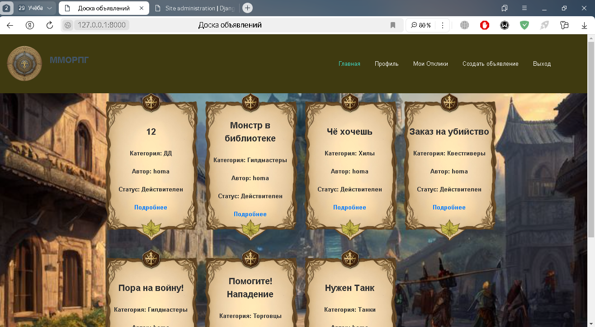
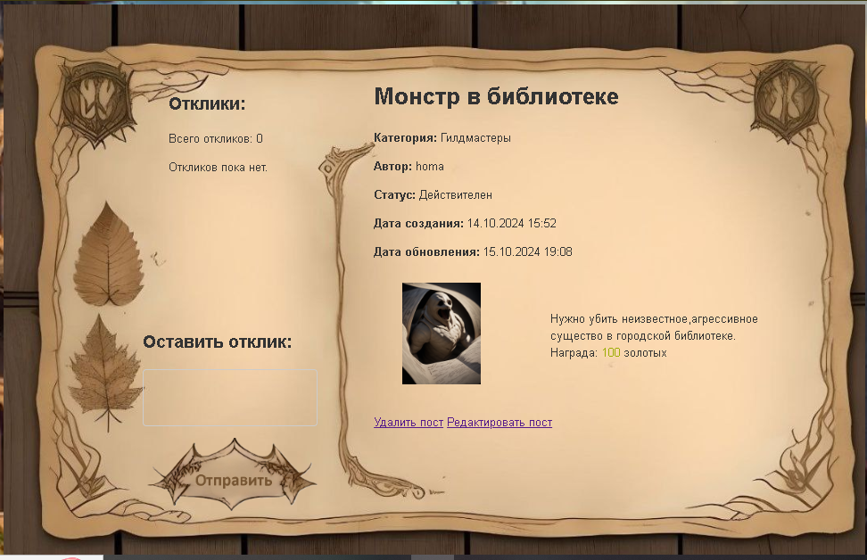
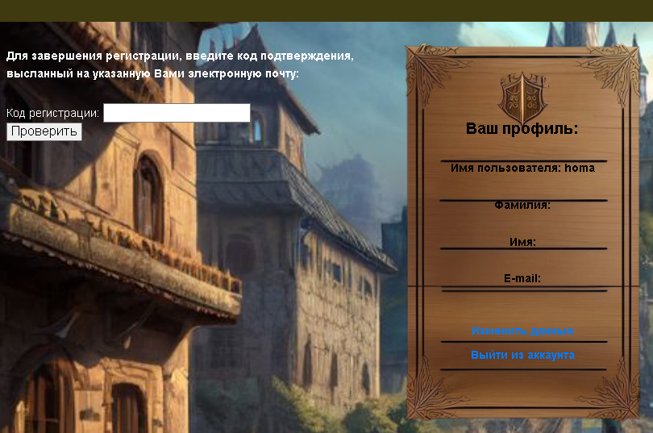
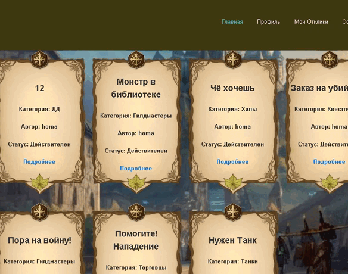

**BulletinBoard**
================

**О проекте**
---------------

BulletinBoard - это интернет-ресурс для фанатского сервера MMORPG, который позволяет пользователям создавать и редактировать объявления, отправлять отклики на объявления других пользователей и получать уведомления о новых откликах. Проект реализует функционал доски объявлений, где пользователи могут делиться информацией о своих услугах или товарах.

**Функционал**
-------------

*   Регистрация пользователей по e-mail с кодом подтверждения регистрации
*   Создание и редактирование объявлений с заголовком и текстом, поддерживающим картинки, встроенные видео и другой контент
*   Отправка откликов на объявления других пользователей с простым текстом
*   Уведомления о новых откликах по e-mail
*   Приватная страница с откликами на объявления пользователя, с возможностью фильтрации, удаления и принятия откликов
*   Категоризация объявлений: Танки, Хилы, ДД, Торговцы, Гилдмастеры, Квестгиверы, Кузнецы, Кожевники, Зельевары, Мастера заклинаний
*   Отправка новостных рассылок пользователям

**Примечание**
-------------
#### Все изображения: (блок-объявление, информация-объявление, кнопка-отправить, логотип и другие), сгенерированы ИИ. А после смонтированы и подогнаны под проект лично мной. Также как и css файлы, все стили я настраивал лично используя также FlexBox.

**Скриншоты**
-------------

### 1. Главная страница

### 2. Информация о объявлении

### 3. Профиль

**GIF-анимации**
----------------

**Видео**
---------
Вы можете смотреть видео-обзор релиза проекта с его функционалом.
[Скачайте видео](media/video.mp4)</video>

**Технологии**
--------------

*   Python 3.x
*   Django 4.x
*   HTML5
*   CSS3
*   JavaScript
*   SQLite
*   CKEditor 5
*   Redis

**Установка**
--------------

1.  Клонировать репозиторий: `git clone https://github.com/Tasank/MMORPG_Site.git`
2.  Установить зависимости: `pip install -r requirements.txt`
3.  Выполнить миграции: `python manage.py migrate`
4.  Запустить сервер: `python manage.py runserver`

**Контакты**
-------------

*   Автор: [Максим Апанасович](https://github.com/Tasank)
*   Email: [apansovich04@mail.ru](mailto:apanasovich04@mail.ru)